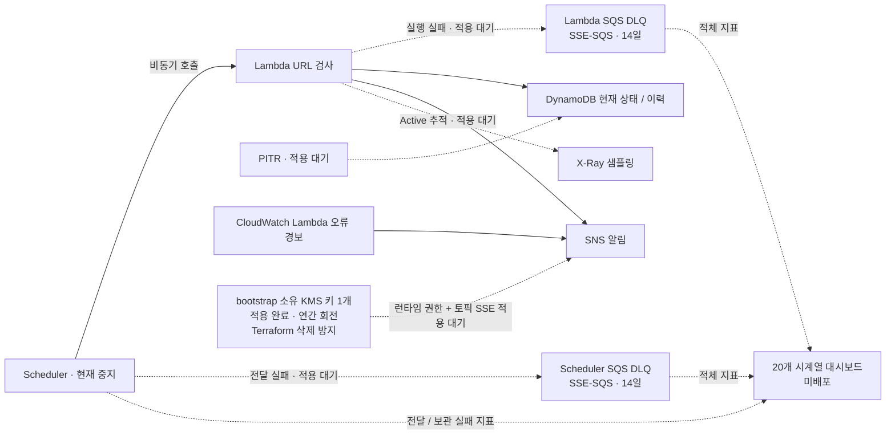
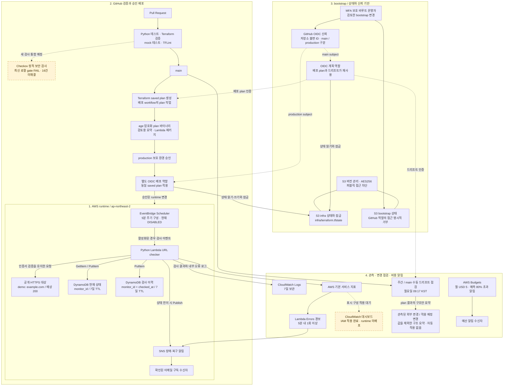

# Terraform AWS URL Monitor 아키텍처

공개 HTTP(S) URL을 검사하고 장애·복구 전이를 알리는 서버리스 프로젝트이다. Terraform은 서울 리전의 runtime 구성과 bootstrap 기반을 분리해 관리한다. 아래 그림은 실시간 화면이 아니라 소스와 검증 기록을 설명하는 구성도이다.

## 상태 표기

**2026-09-07 18:04 KST 검증 기준:** SNS 전용 bootstrap 키·별칭, 추가 배포 IAM, 상태 저장소 정리 규칙은 별도 승인을 받아 **AWS 적용·검증 완료**했다. 결과는 추가 2개·수정 2개·삭제 0개이고, 후속 bootstrap 계획은 변경 없음이었다. Scheduler는 설정 변경 없이 `DISABLED`이다. 대시보드·PITR·실패 큐·추적·SNS 토픽 암호화와 런타임 발행자 권한은 아직 미배포다. [bootstrap 적용 기록](bootstrap-hardening-apply-2026-09-07.md)이 새 키와 권한의 실환경 증빙이다.

기존 URL 검사, 현재 상태·이력 저장, SNS 알림, 로그·경보·승인 배포·주간 드리프트 점검과 대시보드 미생성 조회는 이전 기록의 대상이다. 앞선 전체 코드 검증은 Python **71개**, Terraform module **11개**·bootstrap **9개** 통과, Checkov **195 pass / 16 fail / 0 skip / 0 parsing errors**로 gate **FAIL**이었다. [보완 코드 검증](hardening-verification-2026-09-07.md)과 [이전 직접 실행 기록](final-verification.md)은 각 시점의 별도 증빙이며 새 런타임 구성의 실환경 성공을 뜻하지 않는다. 이번 bootstrap 적용에 보안 검사 예외나 운영 배포는 포함되지 않았다.

신규 lab의 직접 수동 5회 시연은 상태·이력·TTL·운영 설정 보존 검증을 통과했다. 전이 로그는 장애 1회·복구 1회 및 계속 `DOWN`일 때 반복 전이 없음을 보였고, 같은 시각의 SNS 토픽 지표는 발행 2·전달 보고 2·실패 0이었다. **Scheduler 경로 시험이나 특정 이메일의 받은편지함 수신·열람 확인은 아니다.** 상세 실측값과 범위는 [검증 증빙](acceptance-evidence.md)에 있다.

## 추가 보완의 배포 경계

2026-09-07 승인한 [저비용 보완 범위](superpowers/specs/2026-09-07-low-cost-hardening.md)는 두 테이블의 PITR, 단계별 실패 보관함 2개, Active 추적, 20개 시계열 대시보드, SNS 전용 고객 관리 키 1개이다. bootstrap 키 자체와 지원 IAM은 적용됐지만 아래 점선의 **런타임 연결·기능은 미배포**다. 기존 장애·복구 알림 시연이 암호화된 새 발행 경로의 검증을 대신하지 않는다.

Scheduler 전달 재시도(300초 / 1회)와 Lambda 코드 오류 재시도(300초 / 0회)는 서로 다르다. 큐에는 자동 소비자나 자동 재실행을 연결하지 않는다. SNS 키는 runtime과 별도인 bootstrap에서 관리하므로 runtime을 제거하거나 자동 검사를 중지해도 키와 보관 비용이 남는다. Terraform state는 기존 SSE-S3를 유지한다. bootstrap 기반 적용은 완료됐고, 다음 런타임 변경은 잔여 검토와 소스 통합 후 별도 saved runtime plan 승인으로 진행한다.

## 네 영역의 구성과 경계

### 1. Runtime: 검사 결과와 상태 전이

현재 설정은 `demo` 하나이며 모듈 입력은 1~5개 공개 HTTP(S) 대상과 1~5초 요청 타임아웃을 허용한다. Lambda는 대상을 순차 검사하며 128MB 메모리, 30초 최대 실행시간으로 구성되어 있다. HTTP 검사 응답시간과 Lambda 전체 실행시간은 별개의 지표이다.

첫 실패는 `PENDING_DOWN`, 두 번째 연속 실패는 `DOWN`이다. 정상 전이 경로에서 처음 `DOWN`이 될 때 장애 알림을 보내고, `DOWN`에서 정상으로 돌아올 때 복구 알림을 보낸다. 계속 실패하는 정상 처리 경로의 중복 장애 알림은 억제하지만, SNS와 DynamoDB 간 원자적 트랜잭션이나 exactly-once 전달은 보장하지 않는다.

현재 상태를 쓴 뒤 이력을 저장한다. 현재 상태의 `status`와 이력의 `state`는 같은 모니터 상태이며 HTTP `status_code`는 이력에만 존재한다. 이력 항목은 URL이나 전체 오류 메시지를 저장하지 않는다. 두 테이블 모두 온디맨드이고 7일 TTL을 사용하며 실제 삭제는 비동기이다.

출처: [runtime Terraform](../modules/url-monitor/main.tf), [입력 검증](../modules/url-monitor/variables.tf), [상태 전이](../lambda/url_monitor/domain.py), [호출·저장 순서](../lambda/url_monitor/handler.py), [저장 필드](../lambda/url_monitor/aws_adapters.py).

### 2. CI/CD: 검증과 적용 권한 분리

CI는 AWS 자격증명 없이 Python 테스트, Terraform 형식·구성 검증, mock provider 테스트와 TFLint를 실행한다. Linux에서는 runtime의 provider lockfile을 읽기 전용으로 초기화한 뒤 validate하여 플랫폼 해시 호환성도 검사한다. 새 구성의 로컬 mock 검증은 module 11개·bootstrap 9개 통과했지만 AWS 배포나 실환경 권한 검증은 아니다. 최신 로컬 Checkov 결과는 37개 리소스, 195 pass / 16 fail / 0 skip, 파싱 오류 0이다. SNS·PITR·DLQ·추적의 기존 지적 5개를 해소했지만 KMS 계정 IAM 위임 문장에 일반 IAM 검사 지적 3개가 추가됐다. 어떤 검사도 숨기거나 예외 승인하지 않았다. 새 코드의 [보완 검증](hardening-verification-2026-09-07.md)과 과거 원격 실행별 [증빙](final-verification.md)을 구분해 읽는다.

배포는 main에서 수동으로 시작한다. OIDC 계획 역할이 saved plan을 만들고 바이너리를 age로 암호화한다. 검토용 텍스트 요약과 Lambda 패키지는 별도 파일이므로 **모든 artifact가 암호화되었다고 표현하지 않는다.** production 보호 환경의 승인 후 별도 배포 역할이 같은 saved plan을 적용한다. GitHub Actions용 장기 AWS 액세스 키를 사용하는 설계가 아니다.

그림에서 Checkov의 점선은 기존 CI에 추가될 검사 위치를 뜻한다. PR 검증 후 main에 반영하고 수동 배포하는 작업 흐름을 표현한 것이며, CI 성공이 자동 apply를 시작하지는 않는다. 계획 역할에서 배포 plan과 드리프트로 나가는 점선은 인증 재사용 관계이다. 드리프트는 배포용 saved plan·artifact·승인·apply 파이프라인을 실행하지 않는다.

출처: [CI](../.github/workflows/ci.yml), [승인 배포](../.github/workflows/deploy.yml), [OIDC·배포 정책](../bootstrap/oidc.tf).

### 3. Bootstrap와 상태 접근 경계

bootstrap은 버전 관리·AES256 암호화·퍼블릭 차단이 설정된 S3 상태 저장소와 GitHub OIDC 역할, 예산 알림, SNS 전용 고객 관리 키·별칭을 관리한다. runtime을 제거해도 이 기반은 별도로 남도록 루트를 분리했다. 같은 버킷의 `infra/`와 `bootstrap/` 키는 별도 상태이며 GitHub 역할에는 `bootstrap/*` 상태 접근과 허용 범위 밖 목록 조회를 명시적으로 거부한다.

계획 역할의 신뢰 조건은 main, 배포 역할은 production 환경에 연결되고 저장소 이름뿐 아니라 불변 owner/repository ID도 포함한다. 계획 역할은 AWS 관리형 `ReadOnlyAccess`와 runtime 상태·잠금 권한을 사용하므로 모든 역할을 일괄하여 최소 권한이라고 주장하지 않는다. 기존 Lambda 권한은 현재 상태 테이블 Get/Put, 이력 Put, 해당 SNS Publish 및 로그 쓰기이다. 미적용 보완 코드는 자신의 실패 큐 SendMessage, X-Ray 쓰기 2개, 정확한 SNS 키·서비스·토픽 조건의 암호화 사용 권한을 더한다. Scheduler에는 해당 Lambda 호출과 자신의 실패 큐 SendMessage만 둔다. KMS의 계정 IAM 위임은 별도 관리자 신뢰 경계이며 두 발행자만이 키에 접근할 수 있는 독점 허용 목록이라고 주장하지 않는다.

bootstrap 변경은 승인된 비루트 운영자 세션에서 별도의 검토한 계획으로 처리한다. CI 검사나 runtime 장애 시연을 이유로 이 접근 경계를 넓히지 않는다.

대시보드 배포를 위해 승인한 bootstrap 관리 정책 변경은 적용했다. UTC `2026-09-07T05:22:33.399618+00:00` 검증에서 `aws_iam_policy.deploy`만 변경되었고 기존 문장 9개, 역할 신뢰 정책·정책 연결은 그대로였다. 추가한 `ManageProjectDashboard`는 해당 프로젝트 대시보드 하나의 정확한 글로벌 ARN에 `cloudwatch:GetDashboard`, `cloudwatch:PutDashboard`, `cloudwatch:DeleteDashboards`만 허용한다. 적용 후 현재 정책은 검토한 계획과 의미상 일치했고 새 전체 bootstrap plan은 변경 없음이었다.

IAM 시뮬레이션 14개 조합은 적용 전 전부 거부, 적용 후 정확한 대상 작업 3개 허용·유사 이름/무관한 이름/합성 다른 계정 및 ListDashboards/PutMetricData 등 범위 밖 11개 거부였다. 필요한 기존 조건 컨텍스트를 제공해 누락 컨텍스트는 없었다. **시뮬레이션은 실제 대시보드 작업의 성공이나 runtime 배포를 뜻하지 않는다.** 상세 결과는 [검증 증빙](acceptance-evidence.md#대시보드-iam-변경의-실환경-검증)과 [대시보드 IAM 변경 기록](dashboard-iam-change.md)에 있다.

출처: [bootstrap 기반](../bootstrap/main.tf), [신뢰·상태 경계](../bootstrap/oidc.tf), [runtime IAM](../modules/url-monitor/iam.tf).

### 4. 관측, 드리프트와 비용

CloudWatch 로그와 Lambda 내부 오류 경보는 기존 구성이다. 대시보드는 기존 서비스 지표를 확인하기 위한 신규 표시 계층으로 로컬 mock 검증과 배포 IAM 적용을 마쳤으나 **runtime 적용은 아직 하지 않았다**. 마지막 확인 결과는 `dashboard_exists=false`이며 Scheduler 입력·설정 변경 없이 `DISABLED`였다. 대시보드 배포 완료나 실시간 화면을 확보했다고 표시하지 않는다. 대시보드가 생겨도 URL 자동 검사 활성화, 장기간 가용률 측정, 신규 조회 API가 자동으로 추가되지는 않는다.

드리프트는 월요일 09:17 KST 또는 main 수동 실행으로 기존 계획 역할과 `infra/terraform.tfstate` 잠금을 사용한다. `terraform plan -json -detailed-exitcode`의 관측된 외부 변경과 적용 예정 변경을 구분하며, 차이 또는 실행 오류는 workflow 실패로 표시한다. raw 값·전체 진단·saved plan을 공개하지 않고 자동 apply나 force-unlock을 수행하지 않는다. 이 점검은 bootstrap, 미관리 AWS 자원, DB 항목, URL 가용성의 검증을 대신하지 않는다.

예산은 월 USD 5, 예측 사용액 80% 초과 알림이다. 실제 청구액이나 자동 지출 차단 한도가 아니며, 대시보드·로그 쿼리·서비스 요청·GitHub runner 사용을 일괄 무료라고 단정하지 않는다. 기존 5분 URL 자동 검사는 비용 관리 목적으로 중지되어 있다. 비용 수치는 실측 자료가 확보된 경우에만 추가한다.

출처: [관측 리소스](../modules/url-monitor/main.tf), [드리프트 workflow](../.github/workflows/drift.yml), [안전한 요약 스크립트](../scripts/drift_check.py), [운영 범위](runbook.md#weekly-infrastructure-drift-check), [예산 설정](../bootstrap/main.tf).

## 별도 제안: 조회 API와 상태 페이지

DB 이력을 읽는 조회 API, 로그인으로 보호하는 운영 상태 페이지, 응답시간 추세 표시는 **제안 단계이며 미승인·미구현**이다. `상태 페이지 → API Gateway → 조회 전용 Lambda → 기존 DynamoDB` 연결을 추천한다. JWT 인증으로 API 접근을 제한할 수 있지만 이는 아직 구현된 기능이 아니다([AWS JWT authorizer 문서](https://docs.aws.amazon.com/apigateway/latest/developerguide/http-api-jwt-authorizer.html)). 위 구성도의 배포된 자원이나 이번 대시보드·Checkov·증빙 보강 범위에 포함하지 않는다. 추진하려면 인증 방식, 조회 범위·호출량·비용, UI 호스팅과 배포 방식을 따로 결정해야 한다. 가용률 집계는 자동 검사 활성화와 충분한 측정 기간, 미측정 구간 처리 원칙이 정해진 뒤 추가한다.

제출 자료에는 계정 ID·이메일·키·토큰·원본 state·raw plan을 넣지 않는다. 실환경 검증, 로컬 테스트, 개발 중인 구성과 향후 제안을 [검증 증빙 문서](acceptance-evidence.md)의 상태 구분에 맞춰 표현한다.
